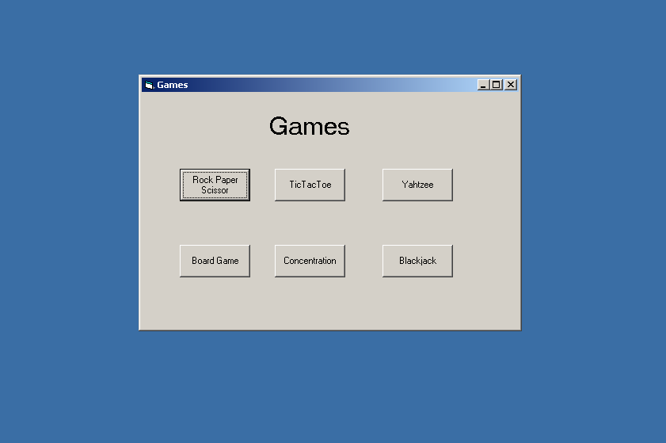
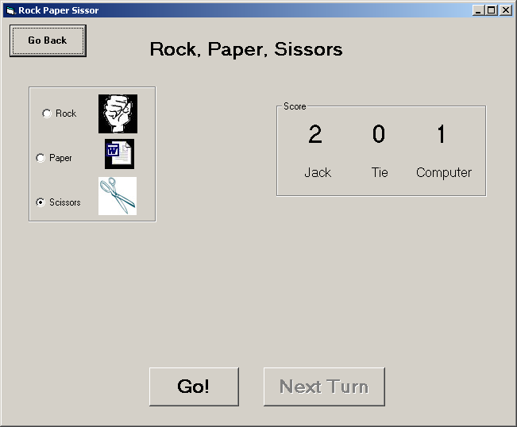
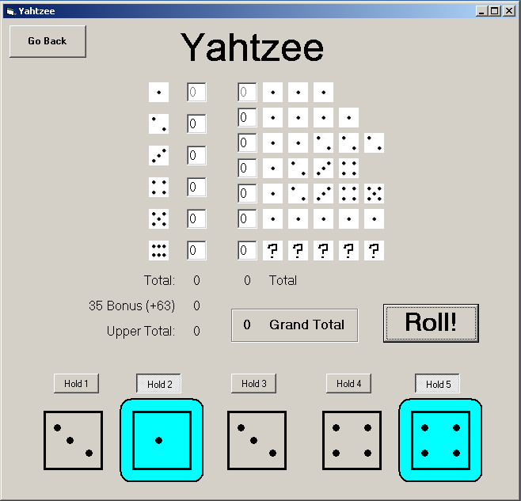
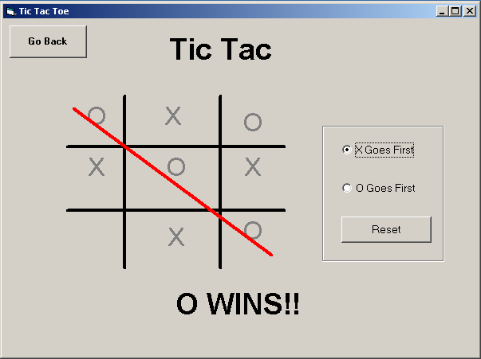
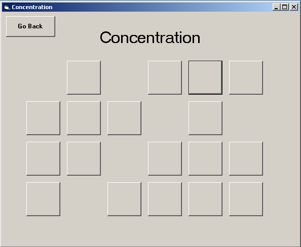
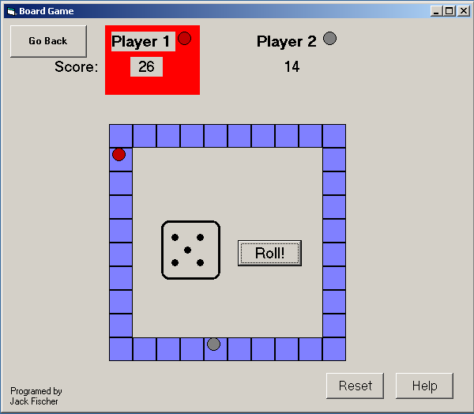
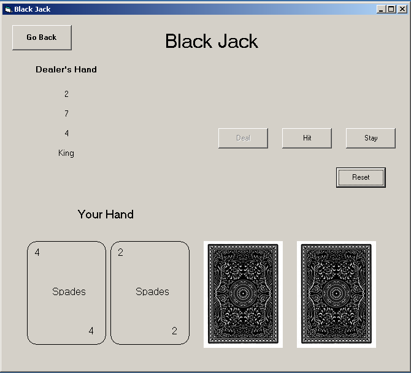

###Really old Visual Basic games
I recently came across this ancient project and it [still worked](Final.exe). Unfortunately the source is long lost. This was the final project for a high school VB class in that I took in 2009-10.

The design is obviously top notch, especially the tic tac toe board. Hopefully this will come back into style.

